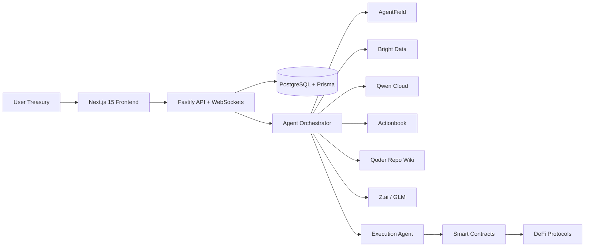

# Aegis AI

Aegis AI is an autonomous AI-powered DeFi treasury management platform designed for institutional stablecoin operators. It predicts future yield, scores protocol risk, watches liquidity and sentiment, and reallocates capital across chains before conditions change.

## What is included

- `apps/web`: Next.js 15 frontend with a cinematic MetaMask-inspired landing page and five product surfaces.
- `apps/api`: Fastify + Prisma API with WebSocket streaming for live treasury activity.
- `services/agent-orchestrator`: AgentField-style multi-agent control plane with Bright Data, Actionbook, Qwen, Qoder, and GLM/Z.ai integration adapters.
- `packages/contracts`: Solidity treasury vault and execution module for autonomous policy-driven capital movement.
- `docs/`: architecture, Zeabur deployment guidance, and a hackathon pitch deck.

## Product surfaces

- Landing page with cinematic hero, animated capital graph, APY ticker, protocol coverage, and institutional messaging.
- Dashboard with portfolio value, chain allocation pie, predicted APY chart, protocol heatmap, live transactions, and AI agent feed.
- AI Allocation Engine showing positions, future yield forecasts, recommendations, confidence, and reasoning.
- Protocol Risk Terminal with radar views, safety heatmaps, exploit probability, and policy thresholds.
- Autonomous Agent Console with terminal-like live logs, agent topology, and shared memory state.
- Wallet page for MetaMask, WalletConnect, and Coinbase Wallet flows across six supported chains.

## Hackathon integrations

- `AgentField`: represented by the agent microservice orchestration layer and shared memory dispatch APIs.
- `Actionbook`: fallback execution planner for browser automation when DeFi APIs fail.
- `Bright Data`: live scraping adapter for protocol, governance, and sentiment intelligence.
- `Qwen Cloud`: reasoning and explainability hooks for protocol risk and allocation narratives.
- `Qoder`: Repo Wiki sync adapter for autonomous engineering workflows.
- `Zeabur`: deployment manifest, Dockerfiles, and CI/CD structure.
- `Z.ai / GLM`: executive summary and reporting adapter for multimodal outputs.

## Quick start

```bash
npm install
cp .env.example .env
npm run prisma:generate -w @aegis/api
docker compose up -d postgres
npm run prisma:push -w @aegis/api
npm run dev
```

Frontend: [http://localhost:3000](http://localhost:3000)  
API: [http://localhost:4000/health](http://localhost:4000/health)  
Agents: [http://localhost:4100/health](http://localhost:4100/health)

## Core architecture



## Agent system

- Yield Prediction Agent: forecasts APYs using LSTM, XGBoost, and transformer ensemble hooks.
- Risk Analysis Agent: scores exploit probability, oracle exposure, liquidity, governance, and bad debt.
- Sentiment Agent: ingests governance discussions and X/Twitter-style signals.
- Execution Agent: plans bridges, swaps, batching, and MEV-aware routing with Actionbook fallback.
- Explainability Agent: produces human-readable reasoning, expected gain, and confidence.

## Supported chains and venues

- Chains: Ethereum, Base, Arbitrum, Optimism, Polygon, Solana
- Venues: Aave, Morpho, Compound, Spark, Pendle, Ethena, MakerDAO

## Deployment

- Dockerfiles included for `web`, `api`, and `agents`
- `docker-compose.yml` included for local stack orchestration
- `zeabur.json` included for service definitions
- GitHub Actions CI pipeline included in `.github/workflows/ci.yml`

## Notes

- The repo ships with realistic demo data and autonomous event simulation so the experience remains compelling even before live protocol credentials are configured.
- The integration adapters are structured for production but keep secrets externalized through environment variables.
- Smart contracts intentionally separate treasury custody from the offchain AI orchestration layer.

