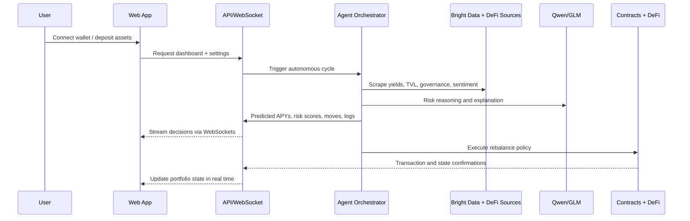

# Aegis AI Architecture

## System overview

Aegis AI is split into four operational layers:

1. Presentation layer
   - Next.js 15 application with real-time treasury dashboards, wallet surfaces, and agent observability.
2. Control layer
   - Fastify API, WebSocket broadcaster, Prisma persistence, policy endpoints, and simulation interfaces.
3. Intelligence layer
   - AgentField-style multi-agent runtime coordinating yield forecasting, risk scoring, sentiment monitoring, execution planning, and explainability.
4. Settlement layer
   - Treasury vault and execution contracts controlling onchain custody and authorized movement instructions.

## Data flow

## Backend domains

- Portfolio snapshots
- Chain allocations
- Protocol allocations
- Yield predictions
- Protocol metrics
- Transactions
- Agent events
- User policy settings

## Risk policy model

- `exploitProbability > 25%` arms emergency defense mode
- `oracleDependency > 75` blocks new entries
- falling governance decentralization increases position haircut
- gas-aware execution discounts gross predicted APY
- stablecoin rotation penalizes depeg risk and weak liquidity

## Integration responsibilities

- AgentField: task dispatch, shared memory, async agent execution, observability
- Bright Data: protocol scraping, governance monitoring, and sentiment intake
- Actionbook: browser-level fallback execution using verified selectors
- Qwen: explainable reasoning and anomaly classification
- Qoder: repo wiki synchronization and engineering workflow automation
- Z.ai / GLM: multimodal summaries, reporting, and deck-generation helpers
- Zeabur: runtime hosting for web, API, agents, and PostgreSQL

